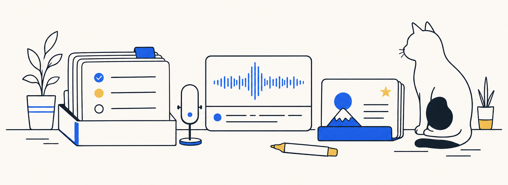

OWEN SHEN / 个人工作台与手记

# 把遇到的问题，做成顺手的工具。

嗨，我是 Owen。做个人工具、学日语，也把试过的办法和没想通的地方记下来。

[↗ 个人网站](https://owenshen.top) &nbsp;·&nbsp; [↗ 项目索引](https://owenshen.top/products) &nbsp;·&nbsp; [↗ 手记](https://owenshen.top/notes)

---

01 / ON THE DESK

## 手边的四件事

<table>
  <tr>
    <td valign="top">
      01 · AGENT 协作 
      <strong><a href="https://owenshen.top/products/personal-workstation">个人工作站 ↗</a></strong>  
      把散在多个 Agent 线程里的任务、上下文和能力接到一处。桌面 App，持续迭代中。
    </td>
  </tr>
  <tr>
    <td valign="top">
      02 · 语言工具 
      <strong><a href="https://owenshen.top/products/tingdong">听懂 ↗</a></strong>  
      给日语对话配上实时中文字幕，也在轮到我开口时帮我找到下一句。目前仍在自用和打磨。
    </td>
  </tr>
  <tr>
    <td valign="top">
      03 · 日语学习 
      <strong><a href="https://owenshen.top/products/language-learning">把日语学进日常 ↗</a></strong>  
      从查词、留下遇到的句子，到真正开口练习；三款小产品正在各自推进。
    </td>
  </tr>
  <tr>
    <td valign="top">
      04 · 桌面实验 
      <strong><a href="https://owenshen.top/products/cat-host">一只还没出道的猫 ↗</a></strong>  
      以我家的猫为原型做的 macOS 桌宠。它已经能在桌面上待着，接下来想让它开口。
    </td>
  </tr>
</table>

02 / PUBLIC CODE

## 公开代码

<table>
  <tr>
    <td><strong><a href="https://github.com/owenshen0907/AiTool">AiTool ↗</a></strong> 集成 Prompt、语音、图像与 Agent 能力的 AI 工具集。</td>
  </tr>
  <tr>
    <td><strong><a href="https://github.com/owenshen0907/tts-stepfun-web">Owen's Cats TTS Web ↗</a></strong> 基于 StepFun 的文字转语音网页应用。</td>
  </tr>
  <tr>
    <td><strong><a href="https://github.com/owenshen0907/patch-courier">patch-courier ↗</a></strong> 把可信邮件对话接入本地 Codex 工作流。</td>
  </tr>
</table>

---

能用的、刚起头的，还有做到一半改了主意的，都记在 [owenshen.top](https://owenshen.top)。

做的时候，顺手记下。

